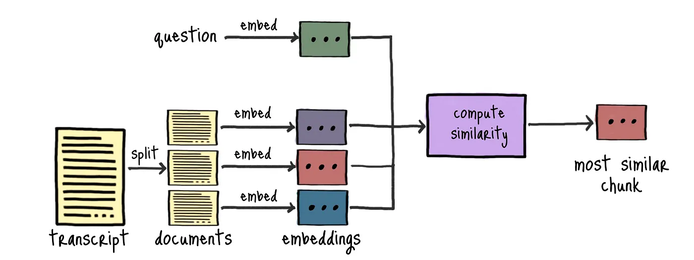
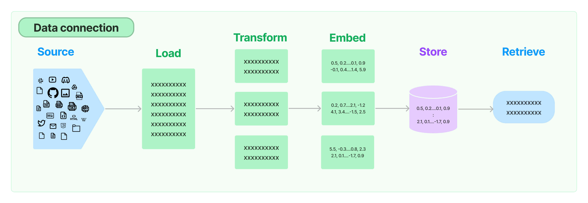
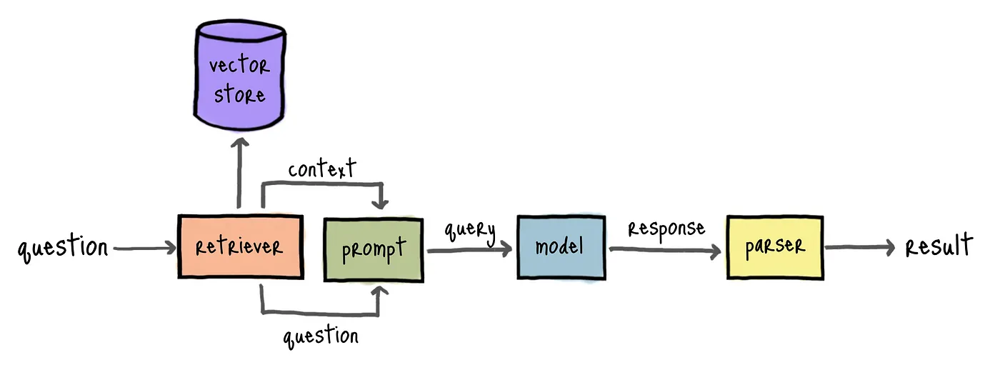

## Source
https://medium.com/@varsha.rainer/building-a-rag-application-from-scratch-using-langchain-openais-whisper-pinecone-6b2fbf22f77f

Here is a summary of the key points from the Medium article "Building a RAG Application from Scratch Using LangChain, OpenAI's Whisper, and Pinecone":

- The article shows how to build a simple application to answer questions from YouTube videos using a large language model (LLM)
- The application uses LangChain, OpenAI's Whisper for speech-to-text transcription, and Pinecone for vector search
- Key steps include:
  - Transcribing YouTube videos using Whisper
  - Embedding the transcripts using OpenAI's text embeddings
  - Storing the embeddings in Pinecone's vector database
  - Building a retrieval-augmented generation (RAG) model using LangChain to retrieve relevant parts of the transcripts and generate answers
- The goal is to create an application that can answer questions about the content of YouTube videos by leveraging LLMs and retrieval from the video transcripts[1]

## Concepts

## Embeddings

## Retrieval

source :  [langchain retrieval](https://python.langchain.com/v0.1/docs/modules/data_connection/)

### Retrivers

Once the vector store is set up, a `Retriever` is used to run sililarity search (question against the documents embeddings) and retrun most similar Once

A retriever is an interface that returns documents given an unstructured query. It is more general than a vector store. A retriever does not need to be able to store documents, only to return (or retrieve) them. Vector stores can be used as the backbone of a retriever, but there are other types of retrievers as well.